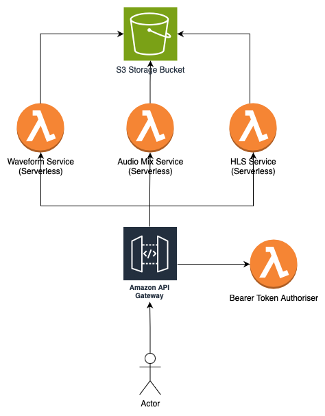

# The Stemplayer-JS Backend API

A nested [AWS SAM](https://aws.amazon.com/serverless/sam/) / Cloudformation stack of certain serverless microservices to provide the stemplayer with

- [Audio conversion of Audio Files into HLS format](https://github.com/sound-ws/hls-service)
- [Automatic generation of waveforms](https://github.com/sound-ws/audio-waveform-service)
- [Mixing together of various stem audio files in order to create a high quality downloadable audio file.](https://github.com/sound-ws/audio-mix-service)

## Usage

You can either deploy from by checking out this repository and following the steps below; but absolutely the easiest way is to deploy it directly from the [AWS Serverless Application Repository](https://aws.amazon.com/serverless/serverlessrepo/) into your own AWS account.

## Prerequisites

- Make sure you have installed [AWS SAM CLI](https://docs.aws.amazon.com/serverless-application-model/latest/developerguide/install-sam-cli.html)
- Create a SAM deployment bucket
- Copy `cp .env.dist .env` and fill out the required variables

## Installation

Run `npm install`

Or `yarn install`

## Deployment

Run `make deploy`

## Test

Run `make test`

## Destroy

To destroy the stack and remove all resources run `make destroy`.

## Production

Make sure that the values for `CORS_ALLOWED_ORIGINS` and `ALLOWED_AUDIO_ORIGINS` (in .env) are set to non wildcard values

## License

Copyright (C) 2019-2024 First Coders LTD

This program is free software: you can redistribute it and/or modify
it under the terms of the GNU General Public License as published by
the Free Software Foundation, either version 3 of the License, or
(at your option) any later version.

This program is distributed in the hope that it will be useful,
but WITHOUT ANY WARRANTY; without even the implied warranty of
MERCHANTABILITY or FITNESS FOR A PARTICULAR PURPOSE. See the
GNU General Public License for more details.

You should have received a copy of the GNU General Public License
along with this program. If not, see <https://www.gnu.org/licenses/>.
